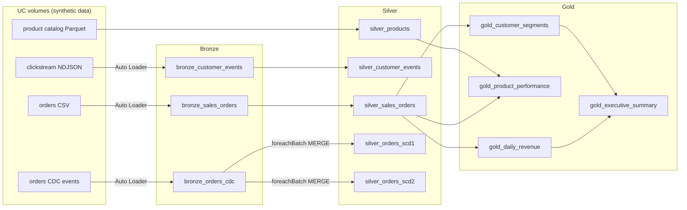

# LakeFlow Medallion Pipeline

An end-to-end **Databricks lakehouse pipeline** for synthetic e-commerce data: incremental
ingestion with Auto Loader, a Bronze → Silver → Gold medallion model, change data capture
into SCD Type 1 and Type 2 tables, Unity Catalog governance, and the same flow as a
**Lakeflow Declarative Pipeline** (DLT). The transform logic is a tested Python package,
and the whole project deploys as a **Databricks Asset Bundle**.


## What it covers

| Area | Where |
|---|---|
| Auto Loader (`cloudFiles`): incremental CSV/JSON ingestion, schema inference and **schema evolution**, `_metadata` provenance, rescued data | [01a](notebooks/01_bronze/01a_autoloader_csv.py), [01b](notebooks/01_bronze/01b_autoloader_json.py) |
| SQL streaming tables (`CREATE OR REFRESH STREAMING TABLE … STREAM read_files`) vs `COPY INTO` | [02](notebooks/02_streaming_tables/02_streaming_tables.sql) |
| Silver: validation, deduplication, business rules, single-pass data-quality metrics | [03](notebooks/03_silver/03_silver_transform.py), [transforms.py](src/lakeflow_pipeline/transforms.py) |
| Declarative pipeline: streaming tables, expectations, materialized views, **AUTO CDC** (SCD1 + SCD2) | [04](notebooks/04_declarative_pipeline/04_medallion_pipeline.py) |
| Gold: KPIs, product ranking, RFM segmentation, **incremental MERGE**, OPTIMIZE/Z-ORDER, time travel | [05](notebooks/05_gold/05_gold_analytics.py) |
| Unity Catalog: column masks, row filters, tags, lineage system tables, grants | [06](notebooks/06_governance/06_unity_catalog_governance.sql) |
| CDC with `foreachBatch` + MERGE: SCD1 with a sequence guard, SCD2 version chains | [07](notebooks/07_cdc/07_cdc_scd.py), [cdc.py](src/lakeflow_pipeline/cdc.py) |
| Testing and CI/CD: pytest on local Spark + Delta Lake, GitHub Actions, Asset Bundle job | [tests/](tests), [ci.yml](.github/workflows/ci.yml), [databricks.yml](databricks.yml), [08](notebooks/08_testing/08_run_tests.py) |

## Architecture



## Repository layout

```
notebooks/        Databricks notebooks (source format), run in numeric order
src/lakeflow_pipeline/
  transforms.py   pure DataFrame → DataFrame logic (Silver, Gold, CDC helpers)
  cdc.py          SCD1 / SCD2 MERGE into Delta tables
  datagen.py      seeded synthetic data generator (Faker)
tests/unit/       pytest: transforms, data generator, MERGE on real Delta Lake
tests/integration data contracts on the live tables (run on Databricks by notebook 08)
databricks.yml    Asset Bundle: declarative pipeline + orchestration job
scripts/          static checks for notebooks (used in CI)
```

## Running it

### On Databricks
Needs a Unity Catalog workspace where you can create a schema. The notebooks default to
catalog `workspace` and schema `lakeflow_demo`; change the `catalog` / `schema` widgets
(and the `USE` lines in the two SQL notebooks) if yours differ.

**Option A: notebooks.** Add this repo as a Git folder, then run `00_generate_data` followed by
01a → 08 in order. `04` is a pipeline source: create a pipeline pointing at it, or use option B.

**Option B: Asset Bundle.** With the [Databricks CLI](https://docs.databricks.com/dev-tools/cli/)
authenticated to your workspace:
```bash
databricks bundle validate
databricks bundle deploy
databricks bundle run lakeflow_medallion_job   # data → bronze → silver → gold, CDC, pipeline, tests
```

### Tests on your machine
Needs Python 3.10+ and Java 17.
```bash
pip install -r requirements-dev.txt
python scripts/check_notebooks.py
pytest -v          # 19 tests; the 4 integration tests skip outside Databricks
```

## Design notes

* **Logic in a package, I/O in notebooks.** Transforms are plain functions tested on local Spark;
  notebooks import them from `src/` (and the pipeline via `bundle.sourcePath`).
* **MERGE needs one source row per key.** CDC batches contain several changes per order, so
  SCD1 merges only the latest change per key, and SCD2 closes versions using the earliest change per key.
* **Replays are harmless.** SCD1 only applies a change if it is newer than what the row already
  holds (`source._event_ts > target._event_ts`). SCD2 runs inside `foreachBatch` behind a
  streaming checkpoint, so each batch is appended exactly once.
* **Schema evolution restarts on purpose.** With `addNewColumns`, Auto Loader stops the stream
  when a new column appears; `01a` restarts it once so the column is picked up.
* **ANSI-safe casts.** `try_cast` turns unparseable values into NULLs that validation drops,
  instead of failing the batch (ANSI mode is on by default on serverless).
* **Join grain.** The product catalog has one row per supplier; Silver collapses it to one row
  per product so joins can't multiply revenue.
* **Reproducible analytics.** Seeded data, and RFM recency measured from the latest order in the
  data rather than today's date.

## Status

* Unit tests (including MERGE on Delta Lake) and notebook checks: run in CI on every push.
* End-to-end run on a Databricks workspace: _not yet recorded_.

## Credits

Built while studying Databricks' Lakeflow (Connect and Declarative Pipelines) learning
material. All data is synthetic, generated with Faker. Not affiliated with or endorsed by
Databricks. Databricks, Delta Lake and Apache Spark are trademarks of their respective owners.

## License

[MIT](LICENSE) © 2026 shcodegen
